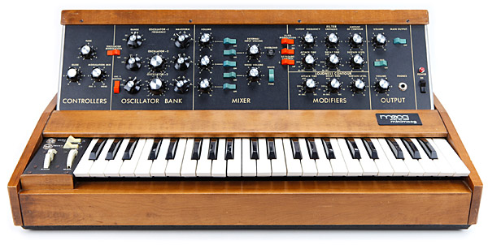

Implementation of a mini Moog in no way meant to be perfect.
Just meant for college learning of VST plugins.



To Build:

Instal Visual Studio 2017 Community with CMake
ensure CMake is on your PATH.

From project root:
```
mkdir build

cd build

UNIX Makefiles

* cmake -G "Eclipse CDT4 - Unix Makefiles" -DCMAKE_BUILD_TYPE=Debug -DCMAKE_ECLIPSE_GENERATE_SOURCE_PROJECT=TRUE -DCMAKE_ECLIPSE_MAKE_ARGUMENTS=-j8 .. 
Visual Studio 2012 

* 32 bit: `cmake -G "Visual Studio 11" ..`
* 64 bit: `cmake -G "Visual Studio 11 Win64" -DWIN64:Bool=True ..`

Visual Studio 2017

* 32 bit: `cmake -G "Visual Studio 15" ..`
* 64 bit: `cmake -G "Visual Studio 15 Win64" -DWIN64:Bool=True ..`

```
open solution and build the VST or build from command line 

```
cmake --build . --target minimoog --config Debug

```

Documentation:

Install TeX Live

```
latex moog.tex

dvips moog.dvi -Ppdf

ps2pdf moog.ps

```
//TODO:

make epub

get postscript and english translation of TeX.

get it working in Cubase and Live 10.

[MIT TeX reference](https://kb.mit.edu/confluence/pages/viewpage.action?pageId=3907150)

[Core Audio Utility Classes](https://developer.apple.com/library/archive/samplecode/CoreAudioUtilityClasses/Introduction/Intro.html)

[Offical Moog Voyager Plug SE](https://www.moogmusic.com/products/apps/voyager-plug-se-vstau)

[Bristol](http://bristol.sourceforge.net/emulations.html)
