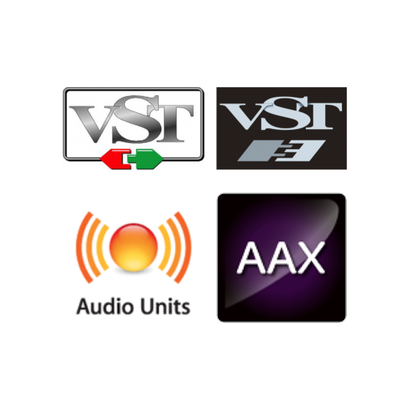

The following repository is and was meant to be used with Will Prickle's RackAFX 
I've followed the tutorials to setup an "All_SDK".

RackAFX can be downloaded from [here:](http://www.willpirkle.com/rackafx/downloads/)

The Books and Sample Projects can be downloaded from the Professors [website](http://www.willpirkle.com )

AAX/AU/VST Project Exporting using RackAFX Part 1. [here](https://www.youtube.com/watch?v=qXkah52VKaE)

